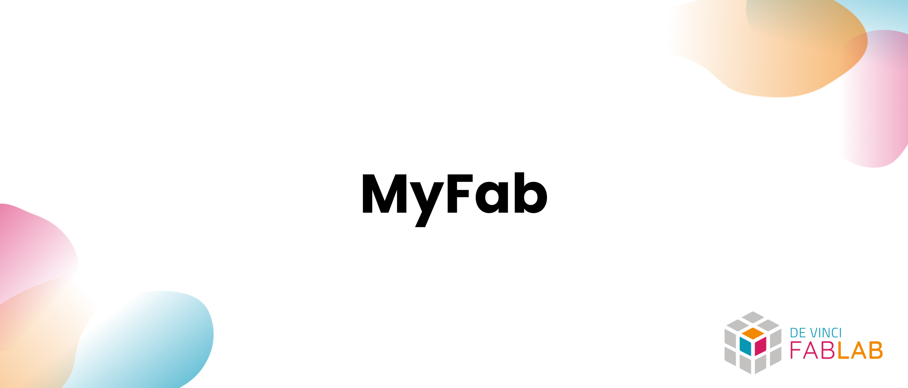

## Overview

> Home repository of the MyFab project.

This repository is the gathers the different repositories of the MyFab project that aims to provide a platform to manage the different aspects of the DeVinci Fablab. The project is divided into several repositories to facilitate the management of the project.

## Getting Started

- [Overview](#overview)
- [Getting Started](#getting-started)
  - [Documentation](#documentation)
  - [Supported languages](#supported-languages)
  - [Roadmap for future improvements](#roadmap-for-future-improvements)
  - [Contributing](#contributing)
  - [License](#license)

### Documentation

The deployment documentation is available [here](https://github.com/DeVinci-FabLab/MyFab-Home/blob/main/docs/index.md).

This repository contains the documentation of the deployment only. Here are the links to the other repositories documentation:

- [Backend](https://github.com/DeVinci-FabLab/MyFab-Backend/blob/main/docs/index.md)
- [Frontend](https://github.com/DeVinci-FabLab/MyFab-Frontend/blob/main/docs/index.md)
- [Components](https://github.com/DeVinci-FabLab/Components/blob/main/docs/index.md)

### Supported languages

- English 🇬🇧
- French 🇫🇷 [partial]

### Roadmap for future improvements

[Insert the project link here]

### Contributing

If you want to contribute to the project, please read the [CONTRIBUTING](./.github/CONTRIBUTING) file and contact the project manager.

### License

This project is licensed under the MIT License - see the [LICENSE.md](./LICENSE) file for details.
